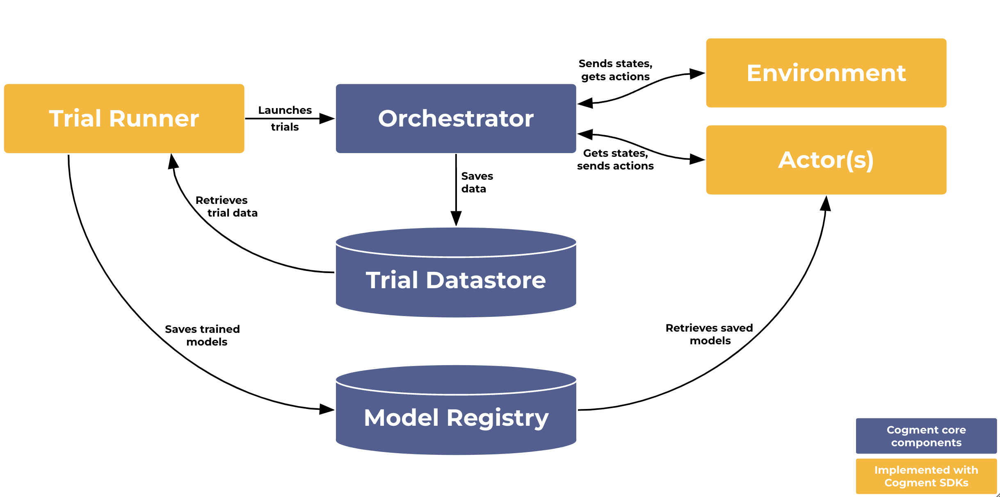

# Core Concepts

Cogment is built around concepts adapted from multi-agent systems (actors, environment), Markov decision processes (action and observation space) and reinforcement learning (trials, rewards). This page aims to explain these concepts at a high level and give some idea of how they are used in Cogment.

At the most basic level, Cogment facilitates interactions between [Actors](#actors) and their [Environment](#environment). Actors take in observations of the Environment as input, and use these to generate actions as outputs. The Environment takes actions as inputs, and outputs the consequences of that action, such as the next observation and, optionally, a numerical feedback signal about how good or bad the action was (eg. reward).

Cogment is designed so that components like the Environment and the Actors can be run as distributed services with easily interchangeable implementations, and with a system to enable efficient transfer of information between services.

## Environment

The Environment is the context in which Cogment [Trials](#trials) are run. The Environment is the main integration point between Cogment and an external system, either a **simulation** or a **real world system**.

In the most general terms, the Environment is the world in which a human or computer agent (eg. [Actors](#actors)) can take actions. For example, in the Atari game [Pong](https://en.wikipedia.org/wiki/Pong), the Environment is the simulated arena in which players control "paddles" to keep a "ball" within the bounds of the screen. The Environment also includes the set of rules for what actions exist (eg. you can move your paddles up and down, but not left and right) and also how the game evolves as a consequence of certain actions being taken.

### State and Observation Spaces

The Environment can be in different states. The set of all possible states the Environment could be in is called the "state space". Usually an Actor needs to have some knowledge about the current state of the world they're in to make decisions about what action should be taken. The Actor doesn't always get access to every detail about the current state of the Environment, but rather gets **observations** of the current state. The set of all possible observations an Actor could see is called "observation space". In Cogment, we only explicitly deal with **observations** of the Environment.

### How the Environment works in Cogment

In Cogment, the basic outline of the Environment is given in the [specification file](../reference/cogment-yaml.md), which configures what parameters are important for setting up the Environment. The general structure of how an Environment works (eg. what info it takes as input and what it generates as output) is specified in the Environment _implementation_, along with the rules of how the Environment responds to a given action and produces subsequent observations for the Actor(s). The Environment implementation is accessed by the [Orchestrator](#orchestrator) to run the Environment during [Trials](#trials).

Using one of [Cogment's SDKs](development-guide.mdx), the Environment can be implemented as a function integrating a _"state of the world"_ with the Trial. This function performs the following tasks during the Trial:

-   Generate Observations from the current state of the world, for example retrieving the visible objects from a 3D simulation.
-   Apply the Actions, thus updating the state of the world, for example changing the velocity of a moving vehicle in a race simulation.
-   Evaluate the performance of [Actors](#actors) and send them Rewards, for example by checking if a vehicle crossed the finish line in a race simulation.

## Actors

Actors are roles that can _do_ stuff, eg. Actors take actions which may affect the state of the Environment. In Cogment, Actors can be either humans or computer-based agents and effectively operate identically.

### Action Space

Actors take Observations about the current state of the Environment as inputs, and produce actions as outputs. The set of all actions that can be produced is called the "Action space".

Each Actor can get a different Observation from the Environment representing what it perceives about the state of the world. The action represents the decision the Actor takes upon receiving this observation. The action selected by the Actor is then applied by the Environment. Cogment leverages this discrete update to orchestrate the execution of the components and the dispatch of data between them.

### How Actors work in Cogment

Cogment allocates a dedicated gRPC service to run the computations of Actors, which we call the "Actor Service". It can also refer to the computational node running this service. This service effectively offers the registered actor implementations for use in trials.

The Actor class specifies what kinds of inputs and outputs to expect. The class definition specifies _what_ an actor is.

The Actor implementation is the function the Actor uses to compute what action to take given some input information. If we want to have a bunch of different Actors that all behave similarly (take same kind of inputs and produce same kind of outputs) we can define an Actor class and different instances of that class can use different implementations.

#### Client and Service Actors

An Actor might be controlled either by a software agent, or by a Human. Whichever the case, the process of generating actions based on observations remains the same, and the [Environment](#environment) treats them the same. Some Actors connect to the trial (we call them "client" Actors) and others will wait for the trial to connect to them (we call these "service" Actors). Service Actors are run on a designated computational node called the Actor Service.

## Interactions between Actors and the Environment

The Observations and Actions we discussed above are the key pieces of information exchanged between Actors and the Environment.

-   Environments take actions as an input and output observations,
-   Actors take observations as an input and output actions.

As discussed before, the Environment can also provide feedback to the Actor about their actions in the form of a numerical reward signal, but it is not strictly necessary for the Environment to do so.

In Cogment, Actors and the Environment exchange information via the [Orchestrator](#orchestrator) - a core component of Cogment which facilitates the interaction of distributed services. To do so, the observation and action space for the Actors and the Environment are defined as typed data structures. Cogment uses [Protocol Buffers](https://developers.google.com/protocol-buffers/) as a format to specify these data structures. This typing defines both an interface contract between the Actors and the Environment and helps convey semantic information, thus facilitating the independent design and development of both. In practice this enables the Actors and Environment to be run as separate services (eg. on separate computational nodes) and have the [Orchestrator](#orchestrator) pass these protobuf messages between the different services as needed.

## Trials

Trials are how a Cogment deployment runs the sequential interactions between [Actors](#actors) and their [Environment](#environment). A trial is defined by the participating [Actors](#actors) and the host [Environment](#environment). As a concept, Trials are quite close to Reinforcement Learning's **Episodes**, i.e. all the states that come between an initial state and a terminal state. However, because Cogment can be used outside of an RL context, we prefer using the more generic term of Trial.

### How Trials work in Cogment

Trials are started by clients connecting to Cogment. A trial can end either by being terminated from a client or end by itself, for example once a specific state of the Environment is reached.

During the trial:

-   The [Environment](#environment) generates [**observations**](#states-and-observations) of its internal state and sends them to the [Actors](#actors).
-   Given these observations, each Actor chooses and sends an action.
-   The [Environment](#environment) receives the actions and updates its internal state.
-   **Rewards** can be sent to the [Actors](#actors) from either the Environment or other Actors. A reward is a measure of an actor’s performance within the environment at a given point in time during the trial.
-   [Actors](#actors) receive **rewards** if at least one was sent to them.
-   A log of the activity during the trial (observations, actions, rewards) is produced and can be stored.

#### The Specification file

The configurations for how trial elements are set up are defined in a YAML specification file typically called `cogment.yaml`. This file details how elements of the project work, including its actor classes and their action & observation spaces. You can learn more about the specification file in the [dedicated reference page](../reference/cogment-yaml.md).

---

## Cogment Architecture

Running trials with Cogment usually involves the deployment of a cluster of services and clients. These components are either provided by the Cogment framework, depicted below in blue, or implemented for a particular project with Software Development Kits (SDKs) in either Python or Javascript, depicted below in orange.

User implemented components use one of the [Cogment SDKs](./development-guide.mdx) or directly implement the [underlying protocol](../reference/grpc.md). Components communicate using [gRPC](https://grpc.io), clients can also communicate in a web-friendly way using [gRPC-Web](https://grpc.io/docs/platforms/web/) and [grpcwebproxy](https://github.com/improbable-eng/grpc-web/tree/master/go/grpcwebproxy).

### Context

The Context is a point of entry for Cogment to interface with the different services through SDKs. See also the SDK documentation for Context ([Python](../reference/python.md#class-controller) | [JavaScript](../reference/javascript.md#class-cogmentcontext)).

### Orchestrator

The Orchestrator is the glue that binds everything together. It is responsible for running the [Trials](#Trials) and contacting other services as needed to ensure their execution.

The key aspect of Cogment's orchestrator is its capacity to handle a number of network connections in parallel while keeping its responsiveness.

### Controller

The Controller is a key part of using Cogment, it initiates communication with the Orchestrator to control the execution of [Trials](#trials). It is responsible for starting Trials, retrieving and watching their state (including the end of the trial), or requesting trial termination. You can see more in the [Python SDK documentation](../reference/python.md#class-controller) for the Controller. The Controller is created by the [Context](#context).

### Environment

The Environment implementation is accessed by the [Orchestrator](#orchestrator) to run the [Environment](#environment) during [Trials](#trials).

Using one of [Cogment's SDKs](development-guide.mdx), the Environment can be implemented as a function integrating a _"state of the world"_ with the Trial. This function performs the following tasks during the Trial:

-   Generate Observations from the current _state of the world_, for example retrieving the visible objects from a 3D simulation.
-   Apply the Actions, thus updating the _state of the world_, for example changing the velocity of a moving vehicle in a race simulation.
-   Evaluate the performance of [Actors](#actors) and send them Rewards, for example by checking if a vehicle crossed the finish line in a race simulation.

### Actors

Cogment handles Actors in two different ways: either as a _service Actor_ or as a _client Actor_. **Service Actor** implementations are accessed by the [Orchestrator](#orchestrator) during [Trials](#trials), while **Client Actor** implementations join a Trial by initiating the communication with the Orchestrator. Client Actors implementations can _reach_ a Cogment deployment through [NAT traversal](https://en.wikipedia.org/wiki/NAT_traversal). This makes them particularly well-suited to implement human-driven Actors, in web-browsers for example.

Using one of [Cogment's SDKs](development-guide.mdx) Actors can be implemented as functions handling the integration between a decision-making Actor (software agent or Human) and the [Trial](#trials). This function performs the following tasks during the Trial:

-   Receive Observations and do Actions in response, for example vectorizing the retrieved observation, feeding it to a neural network and converting its output to an Action.
-   Receive Rewards, for example using them to update a neural network.
-   Optionally: send and receive direct messages.

Please note that rewards can also be retrieved after the fact using a [datalog](#additional-optional-services).

### Additional components

On top of the core components described above, a Cogment deployment can include these additional ones:

-   **Datalog** services can be used to listen to the activity during a trial (actions, observations, rewards, messages)
    in order to, for example, store these data for the offline training of AI agents.
    The [**Trial Datastore**](../reference/cli/trial-datastore/trial-datastore-server.md) is an out-of-the-box implementation
    of this.
-   [**Model Registry**](../reference/cli/model-registry.md) handles the storage and dispatch of AI models trained with
    Cogment and used by the actors.
-   [**Directory**](../reference/cli/directory/directory-server.md) handles the publishing and discovery of cogment
    services.

## Components availability summary

The following table summarizes how each component can either be implemented or used out of the box.

| Component              | Cogment                                     | Python SDK                                                  | Javascript SDK                             | gRPC API                                                  |
| ---------------------- | ------------------------------------------- | ----------------------------------------------------------- | ------------------------------------------ | --------------------------------------------------------- |
| Orchestrator           | ✅ [`cogment services orchestrator`][13]    |                                                             |                                            | ✅ implement [Control API][4] & [Client Actor API][2]     |
| Controller             |                                             | ✅ [get controller][10]                                     | ✅ [get controller][18]                    | ✅ use [Control API][4]                                   |
| Environment            |                                             | ✅ [register environment][9] & [serve][8]                   |                                            | ✅ implement [Environment API][3]                         |
| Actor (Service)        |                                             | ✅ [register actor][7] & [serve][8]                         |                                            | ✅ implement [Service Actor API][1]                       |
| Actor (Client)         |                                             | ✅ [register actor][7] & join trial                         | ✅ [register actor][19] & [join trial][20] | ✅ use [Client Actor API][2]                              |
| Trial Datastore        | ✅ [`cogment services trial_datastore`][16] | ✅ [register datalog][11], [serve][8] & [get datastore][23] |                                            | ✅ implement [Datalog API][5] & [Trial Datastore API][22] |
| Trial Datastore Client | ✅ [`cogment client trial_datastore`][24]   | ✅ [get datastore][23]                                      |                                            | ✅ use [Trial Datastore API][22]                          |
| Model Registry         | ✅ [`cogment services model_registry`][17]  |                                                             |                                            | ✅ implement [Model Registry API][21]                     |
| Model Registry Client  |                                             | ✅ [get model registry][25]                                 |                                            | ✅ use [Model Registry API][21]                           |
| Directory              | ✅ [`cogment services directory][26]        |                                                             |                                            | ✅ implement [Directory API][29]                          |
| Directory Client       | ✅ [`cogment client directory][27]          | ✅ [use directory][28]                                      |                                            | ✅ use [Directory API][29]                                |
| Pre Trial Hook         |                                             | ✅ [register pre trial hook][11] & [serve][8]               |                                            | ✅ implement [Pre Trial Hook API][6]                      |

[1]: ../reference/grpc.md#service-actor-api
[2]: ../reference/grpc.md#client-actor-api
[3]: ../reference/grpc.md#environment-api
[4]: ../reference/grpc.md#control-api
[5]: ../reference/grpc.md#datalog-api
[6]: ../reference/grpc.md#hook-api
[7]: ../reference/python.md#register_actorself-impl-impl_name-actor_classes
[8]: ../reference/python.md#async-serve_all_registeredself-served_endpoint-prometheus_port--8000
[9]: ../reference/python.md#register_environmentself-impl-impl_name-default
[10]: ../reference/python.md#get_controllerself-endpoint
[11]: ../reference/python.md#register_datalogself-impl
[12]: ../reference/python.md#register_pre_trial_hookself-impl
[13]: ../reference/cli/orchestrator.md
[16]: ../reference/cli/trial-datastore/trial-datastore-server.md
[17]: ../reference/cli/model-registry.md
[18]: ../reference/javascript.md/#getcontrollerendpoint
[19]: ../reference/javascript.md#registeractorimpl-actorname-actorclass
[20]: ../reference/javascript.md#async-jointrialtrialid-endpoint-actorname
[21]: ../reference/grpc.md#model-registry-api
[22]: ../reference/grpc.md#trial-datastore-api
[23]: ../reference/python.md#get_datastoreself-endpoint
[24]: ../reference/cli/trial-datastore/trial-datastore-client.md
[25]: ../reference/python.md#async-get_model_registryself-endpointendpoint
[26]: ../reference/cli/directory/directory-server.md
[27]: ../reference/cli/directory/directory-client.md
[28]: ../reference/python.md#__init__self-user_id-cog_settings-prometheus_registryprometheus_clientcoreregistry-directory_endpointnone-directory_auth_tokennone
[29]: reference/grpc.md#directory-api
