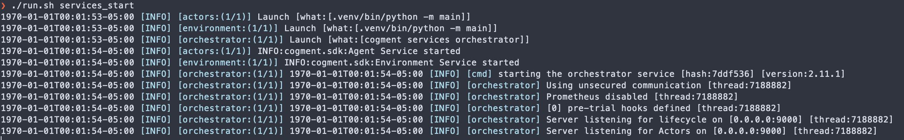
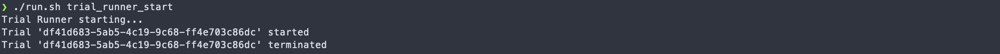
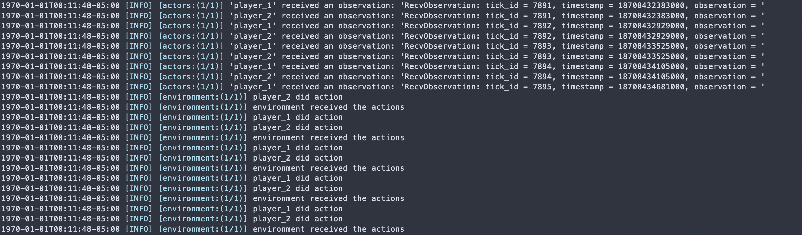

# Set Up the Code & Test a Trial

In this step of the tutorial, we will get the RPS code set up properly and test run a single trial. This will establish the basic working code needed for all subsequent steps of the tutorial. We will go over the components of the repository at a very high level. If any terminology is unclear, it may be useful to refer to the [Core Concepts](../core-concepts.md).

:::note
These instructions are for unix-like environments such as Linux, macOS and WSL2 on Windows.
:::

## Getting Set Up

To begin with, you'll need a working installation of Cogment. If you haven't done so already, follow our [installation instructions](../../reference/cli/index.md).

Additionally, you'll need:

-   [Python](https://www.python.org/) (Cogment currently supports versions 3.7-3.9)
-   [virtualenv](https://virtualenv.pypa.io/en/latest/)

### Cloning the RPS Source Code

If you followed the test step of the installation instructions you have probably already downloaded the sources for the tutorial from the [github repository](https://github.com/cogment/cogment-tutorial-rps). If not, now is the time to do so.

This repository contains completed code for each step of the tutorial in separate folders. If at any point you make a mistake and can't get something working, you can copy the code from the folder corresponding to the last step you completed to get a fresh starting point.

### Creating your development directory

First, let's make a new directory called `rps`, and set this as our working directory. Unless otherwise mentioned, all operations for the rest of the tutorial are done from the `rps` directory. We will then copy the code from the folder for step 1 of the tutorial from the directory `1-setup/`, which contains a blank slate Cogment application as a starting point.

**Execute the following commands in your terminal:**

```console
mkdir rps
cp -r <relative path to cloned repository>/basic_tutorial_steps/1-setup/ rps/
cd rps
```

We now have a starting point for developing the RPS project. This code copied from `basic_tutorial_steps/1-setup` will run an empty Cogment application with two Actors able to play RPS.

## What's in this directory?

### Service Directories

If we look at the elements of `rps`, we will see 3 directories. Each directory contains the code required for managing that service, for now contained completely in a `main.py` file that does all the work for that service. These services are:

-   `environment/` which specifies the dynamics of the game itself (what actions are allowed, what are the consequences of those actions),
-   `actors/` which specifies how the Actor(s) work -- what information they get from the environment, and how they use it for making a decision on what action to take next
-   `trial_runner/` which specifies how the Actors and Environment interact within Cogment, and launches the trials to run the games of RPS.

At this stage, each module contains only the `main.py` files. When we build the application, more files will be copied into each directory automatically.

### Configuration & Execution Files

The root of the `rps` directory also contains files which set the necessary configurations for running the application (`.env`, `data.proto`, and `cogment.yaml`), as well as the `run.sh`, `requirements.txt` and `services.yaml` files, which contain all the functions necessary for installing dependencies and running the Cogment project.

#### .env

This file is used to set environment variables. (Note that "environment" in this context refers to the operating system environment, which is not related to the concept of the Environment in the RL or Cogment context.) The variables set in this file specify configurations that are known to all parts of the application while it is running. The `.env` file is used in this project to specify the TCP ports through which different Cogment services (such as Actors or the Environment) can be accessed.

#### data.proto

In Cogment, we use [Protocol Buffers](https://developers.google.com/protocol-buffers/) to serialize data for communication across different services. In this project, the structure of these protobuf messages are defined in the file `data.proto`. This file does most of the heavy lifting in creating data structures in Python and setting variables to the relevant parameter values (more on this later). The application 'knows' to use the messages defined here by importing it in the `cogment.yaml` configuration file.

#### cogment.yaml

The `cogment.yaml` file specifies all of the details about how the trials will be implemented. In particular, this file defines what protobuf messages the Environment and Actor(s) participating in the trial will expect and use as inputs and outputs. More information about what kinds of information can/should be included in a Spec File such as `cogment.yaml` can be found on the [Spec File reference page](../../reference/cogment-yaml.md).

#### run.sh

The `run.sh` file acts as the main command menu for the Cogment project: it contains all of the functions necessary for building and running the code.

#### requirements.txt

The `requirements.txt` file tells the Python package manager what packages need to be installed for this project to work. If we want any non-standard Python packages to run our application, we will specify them here and the package manager will install them in the virtual environment. For now, this file specifies we only need to install the most recent version of the Cogment Python SDK.

#### services.yaml

The `services.yaml` file is passed to the Cogment CLI utility command `launch`. For the purposes of this tutorial, it's sufficient to understand that the contents of the `services.yaml` file describe a set of processes to be run in parallel - with the additional condition that once any of these processes terminate, the others will terminate as well. More information about the `launch` process can be found on the [Launch reference page](../../reference/cli/launch.md).

## Building the Application

To get all this code to work together, we will need to run the `install` process in the `run.sh` file.

**In your terminal run the `install` process with:**

```console
./run.sh install
```

### What exactly is happening in the install?

We can understand what the `install` function does by taking a closer look at the `run.sh` file. You'll see that this function does the following:

-   Creates a virtual environment and installs Cogment and any required Python packages there
-   Runs the Cogment Python code generation tool to make the files `cog_settings.py` and `data_pb2.py` which are used by the Python SDK to know about the configurations and data structures which will be used in the application (more on this below).

Now everything is set up to start the application.

## Running the Application

Now that we have built all the necessary components, we want to make sure the application can run.

We will need two terminals open:

-   A terminal to run the services. Those services are the `environment`, the `actors`, and the [Cogment Orchestrator](../../reference/cli/orchestrator.md), which is responsible for coordinating the services together.
-   A terminal to run the client that connects to the services in order to run the [trial](../core-concepts.md#trials). This client is the `trial_runner`.

We need to have the services running already before the Trial Runner can connect. **In the first terminal, start the Cogment app services with the command:**

```console
./run.sh services_start
```

This command starts the services named in the `services.yaml` file. You should see something like:



**In the second terminal, start the Trial Runner with the command:**

```console
./run.sh trial_runner_start
```

At this stage, the Trial Runner starts the trial, lets it run for a few seconds, and then terminates the trial. In the second terminal, you will see something like:



In our application services terminal, this will also generate some logs reporting what happened. You should see something like this:



At this point, both the action strings received by the Environment and the Observations received by the Actors are empty. In the next steps of the tutorial, we will add them in.

You can now terminate the services using `ctrl+C`. At this point we have a working but empty Cogment app.

<details>
<summary><b><span style={{fontSize: "20px"}}>Quick Summary</span></b></summary>

We got the RPS code from the [github repository](https://github.com/cogment/cogment-tutorial-rps), and created a new directory `rps` to work from.

We ran

```console
./run.sh install
```

to build the necessary elements to get the app up and running.

In one terminal, we started the `orchestrator`, `environment`, and `actors` services with:

```console
./run.sh services_start
```

In a second terminal, we started the trial runner to begin a trial with:

```console
./run.sh client_start
```

The client terminal printed the start and end of the trial, and the services trial reported some empty actions.

</details>

In [the next step](./2-actors-in-cogment.md), we will look a little more closely at how Cogment represents the Actors, and enable them to select `ROCK`, `PAPER`, or `SCISSORS` rather than empty actions.
