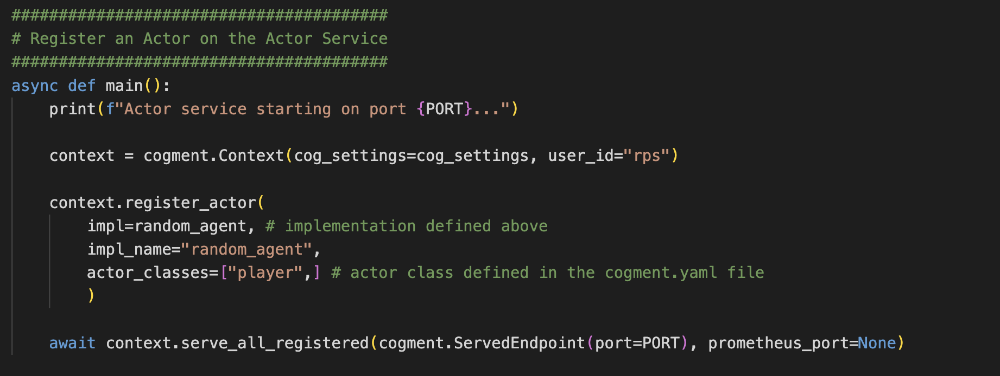

# Actors: Players of RPS

Now that we have a working but empty Cogment app, let's look at how these pieces interact in the context of the RPS game. In this step of the tutorial, we will lay out how Actors are defined in Cogment. To build out our RPS application, we will add the ability for our Actors to select actions (rather than produce empty strings).


## What does Cogment need to know about an Actor?

In Cogment, the general concept of an [Actor](../core-concepts.md#actors) is a role that has agency. In RPS, this is a player of the game. At a high level, Cogment operates the same whether the Actor is human or machine-based. For now, we will just look at machine-based Actors. A more in-depth tutorial will guide you through implementing a [client Actor](../core-concepts.md#client-and-service-actors) which can be used by a human player to participate in the RPS game.

To fully specify Actors in Cogment, we need to define what they do (what observations they take and actions they produce), how they do it, and where they run those computations.

To better understand how Cogment represents Actors, the following terminology is important to highlight:

-   The **Actor Service** is the designated computational node where Actor instances run. A service can manage multiple Actor instances concurrently. The Actor Service is _where_ the computations are run. The Actor Service is launched by `actors/main.py` on the TCP port set by the `ACTORS_PORT` variable in the `.env` file.
-   The **Actor Class** is the specification of the attributes and behaviours that an Actor can have, for example what sort of inputs the Actor expects and what sort of outputs it will produce. If we want to have several different Actors that all behave similarly (take same type of inputs and produce same type of outputs) we can define an Actor class and different _instances_ of that class can use different implementations. The Actor Class defines _what_ the Actor does. The Actor Classes are defined in the `cogment.yaml` file in the root directory (which is copied to each service directory as part of the `./run.sh install` command).
-   The **Actor Implementation** is the logic of how the role operates. Specifically, the implementation refers to the function which controls how the Actor makes decisions about what action to output given some input information about the state of the world. The Actor implementation is _how_ the Actor chooses actions. The function we use for our first Actor implementation is defined in `actors/main.py`.


In the above image, we showcase these different concepts: the **Actor Class** "Player" lays out the skeleton for what components the Actor will need to manage. We can create an **instance** of this class (gray) with an **Actor Implementation** that does random action selection, which takes an Observation as input and produces an action as output. The computations made by the Player Actor instance are run on the **Actor Service**.

## Defining the Actor Service

Let's look at `actors/main.py` to see how Cogment handles the concepts of the Actor Service, Actor Class, and Actor Implementation in the RPS application. If we look at the `main()` function that is invoked by running this file, we see:



The `main()` function first initializes a [context](https://cogment.ai/docs/reference/python#class-cogmentcontext) in which the Actors will be registered. When registering an Actor, we specify the class this Actor will be an instance of (from the options given in `cogment.yaml`), and which implementation will be used. So far in our RPS application, we have only registered one type of Actor: an instance of the `player` class using the `random_agent` implementation.

After registering each of the different types of Actors that Cogment will be responsible for managing in the application, this function starts the Actor Service that will handle any Actor-associated computations on the appropriate port, and awaits the termination of the service.

:::note
Ports for running services are specified in the `.env` file, loaded by the `.run.sh` script, and retrieved by the `os` package to make the variable available to Python. To change the port this service uses, update the`.env` file in the root directory rather than changing `main.py`.
:::

## Defining the Actor Class

The Actor Class is where we define the domain over which the Actor will operate, i.e. what inputs and outputs the Actor is expected to handle. We specify the Actor Class in the `cogment.yaml` file, using the imported [Protocol Buffer](https://protobuf.dev/) (protobuf) messages from the associated `data.proto` file.

The `cogment.yaml` file lets Cogment know how to configure each of the components involved in running the [Trial](../core-concepts.md#trials), so we will return to it again later. The `actor_classes` section describes what types of Actors exist in this game (here only `player` Actors), and what the inputs and outputs of an instance of the `player` class of Actor look like:


This tells Cogment that an instance of the `player` Actor class will expect [observations](../core-concepts.md#state-and-observation-spaces) specified by the `rps.Observation` message, and will produce [actions](../core-concepts.md#the-action-space) of a form defined by the `rps.PlayerAction` message. The Actor Class is fully specified here by its Observation space and Action Space.

:::note
Message types are referenced by `rps.SomeMessageName`, since message types imported from a `.proto` are referred to through their _package_ namespace, which has been set to `rps` in the `data.proto` file. (For more information about the general use of the `cogment.yaml` file, see the [dedicated reference page](../../reference/cogment-yaml.md).)
:::

### Action Space

The action space refers to the set of valid actions which can be taken by an Actor at each step of the game. The `cogment.yaml` file tells Cogment that a member of the `player` Actor class can take actions of type `PlayerAction` as defined in the `data.proto` file.

If we look at the `PlayerAction` message in `data.proto`, we see it is a message of type `Move`, where a `Move` is defined to be one of `ROCK`, `PAPER`, or `SCISSORS`, or an `UNKNOWN` move:


We also specify here that a `Move` is an `enum` type of Protobuf message, meaning that it can take only one of a predefined list of values. We include `UNKNOWN` in this because the first argument of an `enum` will be its [default value](https://protobuf.dev/programming-guides/proto3/#enum), and we don't wish any of our actions to be a default behaviour. Together these specify the action space: a valid action for a `player` type Actor is a single one of the list of possible moves.

### Observation Space

The observation space refers to the set of possible inputs an Actor can receive at each step of the game. Observations are what Actors perceive from the Environment about what is the current state of their world, which they use to make decisions about what actions they should take.

In the context of RPS, the Environment is limited to the two players, the actions they took, and the consequence of both of their actions.

The `cogment.yaml` file tells Cogment that a member of the `player` Actor class receives observations of the form `Observation` as defined in the `data.proto` file.

The `Observation` message type itself specifies that each player considers information about themselves and their opponent, and that these pieces of information are of the type `PlayerState`:


Note that `last_move` is optional because during the first round of the game, the players have not yet played any move. For all other steps of the game, each player is considering what was their last move, their opponents last move, and which of the two of them won or lost the match.

## Defining the Actor Implementation

While the Class defines how an Actor expects to receive observations and output actions, the Actor implementation specifies the details of _how_ the Actor makes decisions. This implementation function is a callback function, used once per actor and per trial and handles the full lifetime of the Actor.

Until now, we have used a partially completed `random_agent` implementation defined in the `actors/main.py` file. It is partially complete because the player's actions are currently empty. In this step, we will enable our Actor to select actions at random.


An Actor implementation specifies:

-   The actor's **initialization**, before the `async for`. This is where, for example, the Actor's internal data can be defined before calling `actor_session.start()` to notify that it is ready.
-   The **event loop**, which specifies how the Actor makes decisions about what action to select in response to an observation in each step, and what kind of rewards it might receive from selecting its action. Here, you can see that by default the `action` gets an empty `PlayerAction` message (the data structure defined in `data.proto`), which has the expected format but contains no data.
-   The **termination** block, i.e. what the Actor does after all the events.

The argument passed to the Actor implementation is the [Actor's session](../../reference/python.md#class-actorsession--session-), which allows the Orchestrator to manage all the data associate with the Actor's operations in the trial.

## Completing the `random_agent` Actor Implementation

We'll modify the `random_agent` function defined in `actors/main.py` to enable our Actor implementation to select random actions (rather than produce empty strings). First, we need to import the different options `Move` can take, as defined in our data structures in `data.proto`. We will also need to import the Python package `random`, which will enable us to choose one of the `Move` options at random.

**In the "Imports" section at the top of the file, add the following:**

```python
from data_pb2 import ROCK, PAPER, SCISSORS
import random
```

We will store all of the possible options for the types of `MOVES` we can take in a list. **Add the following code to the "Settings" section:**

```python
MOVES = [ROCK, PAPER, SCISSORS]
```

Recall from above that the `PlayerAction` message has one field: `move`. This is the piece we need to pass to the formerly empty `PlayerAction` message inside the **event loop** of the `random_agent` instance definition. **Replace the `if event.observation:` block in the event loop with the following:**

```python
if event.observation:
    print(f"'{actor_session.name}' received an observation: '{event.observation}'")
    if event.type == cogment.EventType.ACTIVE:
        action = PlayerAction(move=random.choice(MOVES)) ## NEW IN STEP 2
        actor_session.do_action(action)
```

The completed Actor implementation should look like this:


We now have an Actor that will randomly select actions. We showed earlier in this step of the tutorial where this implementation is used when registering instances of Actors with the service. Next, we will show how Cogment specifies which Actors and how many of them will participate in the Trial.

## Specifying which Actors participate in the Trial

If we look at the `trial_runner/main.py` code, we will see the code that tells Cogment exactly which participants will be part of a trial.


This code creates the context in which to run the trial, and a [controller](../../reference/python.md#class-controller) which will actually carry out the function of starting the trial, monitoring its state, and ending the trial.

This is also where we say specifically which Actors will be part of the trial. Here, we are going to create a trial with two Actors which use identical parameter settings, except for having different names. Each player uses an instance of the Actor type we registered on the Actor Service in `actors/main.py` - if we call for a different implementation or class here, Cogment won't know what to do with that because no other Actor types have been registered with the Actor service.

We can change the player names to `Bob` and `Alice` in `trial_runner/main.py` just to see how that impacts what gets reported as the services are running:

```python
actor_1_params = cogment.ActorParameters(
        cog_settings,
        name="Bob", # player_1
        class_name="player",
        endpoint=ACTORS_ENDPOINT,
        implementation="random_agent"
    )
    actor_2_params = cogment.ActorParameters(
        cog_settings,
        name="Alice", # player_2
        class_name="player",
        endpoint=ACTORS_ENDPOINT,
        implementation="random_agent"
    )
```

To learn more about the parameters, check the [`cogment.TrialParameters`](../../reference/python.md#class-cogmenttrialparameters) class reference.

Then we specify the parameters of the trial -- including the specifications for our two players -- and pass these trial parameters to the controller to start a new trial. In this trial runner, our controller will terminate the trial after the players have played for 5 seconds.

Then the Trial Runner tells the controller to start a trial with the specified parameters. The `start_trial` call will return a unique identifier for the trial. The Trial Runner uses this information to request the end of the trial with `terminate_trial`. It is also possible to tell the controller the ID you want your trial to have, by passing your chosen ID to the `trial_id_requested` parameter of the `start_trial` method. We will do this in the next step of the tutorial.

We can now [run the application](./1-setup.md#building-and-running-the-app), and we will see the service terminal logs report that each player selects a valid action instead of an empty one.


We can also see that the services terminal prints out what the Actors were receiving from the Environment as Observations:


<details>
<summary><b><span style={{fontSize: "20px"}}>Quick Summary</span></b></summary>

We learned about how Cogment represents Actors and the different concepts of the Actor Service, Actor Class, and Actor Implementation.

We enabled the `random_agent` Actor implementation to select actions by importing the `ROCK` `PAPER` `SCISSORS` data structures defined in the `data.proto` (via `data_pb2.py`), the `random` package, and changing the event block to:

```python
async for event in actor_session.all_events():
    if event.observation:
        print(f"'{actor_session.name}' received an observation: '{event.observation}'")
        if event.type == cogment.EventType.ACTIVE:
            action = PlayerAction(move=random.choice(MOVES)) # new in step 2
            actor_session.do_action(action)
    for reward in event.rewards:
        print(f"'{actor_session.name}' received a reward for tick #{reward.tick_id}: {reward.value}")
```

We also looked at how the Trial Runner calls upon Actors to participate in the trial. We modified the parameters for the Actors in the Trial Runner and gave each player a name:

```python
actor_1_params = cogment.ActorParameters(
    cog_settings,
    name="Bob",
    class_name="player",
    endpoint=ACTORS_ENDPOINT,
    implementation="random_agent"
)
actor_2_params = cogment.ActorParameters(
    cog_settings,
    name="Alice",
    class_name="player",
    endpoint=ACTORS_ENDPOINT,
    implementation="random_agent"
)
```

</details>

In the [next step](./3-environment-in-cogment.md) of the tutorial, we will go through how Cogment represents the Environment, and set up the Environment implementation to give `Bob` and `Alice` observations about the state of the world that contain meaningful information.
