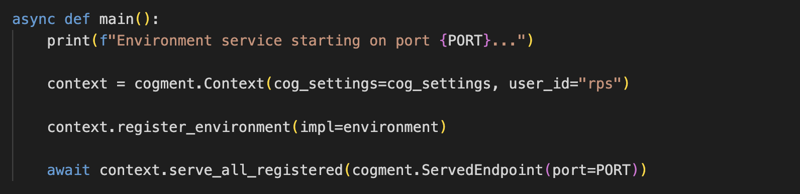
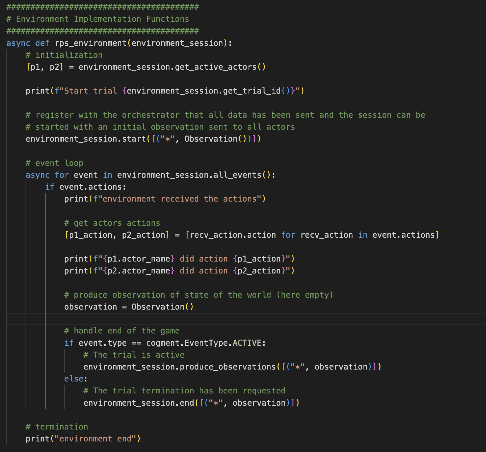

# The Environment: A Game of RPS

In this step of the tutorial, we will look at what is needed to define the Environment in which Actors operate. Our goal in this section is to implement the rules for how the Environment responds to the actions at each step and produces new Observations for the Actors.

## What does Cogment need to know about the Environment?

The [Environment](../core-concepts.md#environment) is the world in which Actors will operate. In the most general terms, we can think of the Environment as being the set of all possible states the world can be in, and the rules which determine the consequences of taking specific actions in these states. For RPS, the Environment can be fully specified by setting which states are possible (the different combinations of `ROCK`, `PAPER` and `SCISSORS` from each Actor), and the rules for what happens when we observe each pair.

To fully specify the Environment in Cogment, we need to define what the Environment is (eg. what makes an RPS game), how computes the outcome of player actions, and where those computations are run.

To better understand how Cogment thinks of the Environment component, we use the following terminology (similar to that used for Actors):

-   The **Environment Service** is a designated node for taking care of the computations made by the Environment. This is _where_ the Environment computations happen. The Environment Service is launched by `environment/main.py` on the TCP port set by the `ENVIRONMENT_PORT` variable in the `.env` file.
-   The **Environment Implementation** is the function that specifies the rules of the game. The implementation takes actions as inputs and produces observations as outputs. This is _how_ the Environment operations work. The Environment implementation function we will use is `rps_environment` defined in `environment/main.py`

Notice that we don't use a class to define _what_ the Environment does, as we did for the Actors. The specification is still made in the `cogment.yaml` file, but instead we define what an RPS game is with the `EnvironmentConfig` message type from the `data.proto`. You can look in `cogment.yaml` and `data.proto` to see, but so far the message is still empty. We will add the necessary information to the message later in this step of the tutorial.

## Defining the Environment Service

Let's look at `environment/main.py` to see how Cogment sets up the Environment.


The code is very similar to what we saw previously for the Actor service: The `main()` function first initializes a [context](https://cogment.ai/docs/reference/python#class-cogmentcontext) in which the Environment will be registered. When registering the Environment in the context, we use the `register_environment` method which takes only an implementation. Here we will use the `rps_environment` function (also defined in `environment/main.py`, more on this in a moment) as our implementation.

Then, the `main()` function will start the Environment service on the appropriate port, and awaits the termination of the service.

:::note
Ports for running services are specified in the `.env` file, loaded by the `.run.sh` script, and retrieved by the `os` package to make the variable available to Python. To change the port this service uses, update the`.env` file in the root level of the `rps` directory rather than changing `main.py`.
:::

## Defining the Environment Implementation

The implementation function, called `rps_environment` here, is structured similarly to the Actor's implementation.



Similar to the Actor implementation, there are three parts to the Environment implementation:

-   The **initialization** block, where we can set variables that are important to know before the session starts. Later in this step of the tutorial, we will set up the initialization block to keep track of some stats about previous actions taken and which player won/lost each round.
-   The **event loop**, which specifies how the environment produces observations based on the Actors' actions.
-   The **termination** block, i.e. what happens after all the events have occurred. Here we'll use the termination block to print out some information about what happened between the players during a round of play.

As with the Actor implementation, the Environment implementation takes as an argument the [Environment session](../../reference/python.md#class-environmentsession--session-), which allows the Orchestrator to manage all the data associate with the Environment's operations in the trial.

Note that the Environment implementation makes use of the `Observation` the data structure defined in `data.proto` defining the actors observation space, but so far it is just empty - we have not yet provided any data to populate the `Observation` message.

## Implementing the rules of the game

We will first need to bring in the relevant datastructures into the `environment/main.py` file so that our Environment implementation can work with the same action space and can create the bservations in the format the Actors expect to receive. We can see in `environment/main.py` that we have already imported the `Observation` data structure.

If we look at the definition of the `Observation` message in the `data.proto`, we see that it stores two fields of `PlayerState` information: one field keeping track of the player itself and one keeping track of its opponent. This means in order to create the correct type of `Observation` messages, we will also need to import the `PlayerState` data structure to `environment/main.py`. We will also need to import the types of moves that can be made so that we can define the relationships between them.

**In the "Imports" section at the top of the file, add the following:**

```python
from data_pb2 import PlayerState, ROCK, PAPER, SCISSORS
```

Next we can define a mapping between each move and the move that it defeats - this is basically all of the information necessary to establish the rules of the game. **In the "Settings" section, add the following:**

```python
DEFEATS = {
    ROCK: PAPER,
    SCISSORS: ROCK,
    PAPER: SCISSORS
}
```

You may have played RPS in which the winner is "best of N rounds" - for example, you must beat your opponent in 2 out of 3 rounds to win the game. We will want the Environment implementation to keep track of the number of rounds played and won by each of the two players so that we can know when to call a winner. Here we will create a simple `state` data structure in the `rps_environment` initialization block to keep track of how often each of players wins a round during the trial. Later we will set up how many successful rounds constitute winning the game. **Add the following code to the initialization block of the Environment implementation function (before the event loop):**

```python
state = {
    "rounds_count": 0,
    "p1": {
        "score": 0
    },
    "p2": {
        "score": 0
    },
}
```

### The Initialization Block: Creating the First Observations for Each Player

When we start a Trial, each player will need an initial `Observation` from the Environment. The `Observation` message tracks what each player's last move was and whether they won or lost the previous round, so we will have to set these by hand to start. **Add the following code to the initialization block:**

```python
p1_state = PlayerState(won_last=False, last_move=None)
p2_state = PlayerState(won_last=False, last_move=None)
environment_session.start([
    (p1.actor_name, Observation(me=p1_state, them=p2_state)),
    (p2.actor_name, Observation(me=p2_state, them=p1_state)),
])
```

This code does the following:

-   Sets the initial state for each of the two Actors - neither won last game nor had a last move
-   Calls for the session to start, which tells the Orchestrator to send an initial observation is sent to all actors. Each actor is given the appropriate `Observation` constructed with the correct initial `PlayerState` messages. One instance of `PlayerState` per player is created, each is used as the `me` and `them` state of each player's `Observation`

### The Event Loop: Creating New Observations in Response to Player Actions

In the **event loop** we implement how the Environment produces the next Observations in response to the Actor's actions. We need to retrieve each player's action and determine which player won the round. Then, we update the internal `state`. Finally, we produce up-to-date observations for the players.

So far, we have printed the actions the Environment received from each player, but these are the `PlayerAction` data structures. What we actually want to work with is the `.move` attribute, which stores the index of the action that was taken. We'll use this `move` attribute to determine which of the two players wins. If the two players had the same move, nobody wins. We'll also keep track of this in our `state` object. **Add the following code below your print statements:**

```python
# Compute who wins, if the two players had the same move, nobody wins
p1_state = PlayerState(
    won_last=p1_action.move == DEFEATS[p2_action.move],
    last_move=p1_action.move
)
p2_state = PlayerState(
    won_last=p2_action.move == DEFEATS[p1_action.move],
    last_move=p2_action.move
)

# keep track of winner/loser of each round
state["rounds_count"] += 1
if p1_state.won_last:
    state["p1"]["score"] += 1
    print(f"{p1.actor_name} wins!")
elif p2_state.won_last:
    state["p2"]["score"] += 1
    print(f"{p2.actor_name} wins!")
else:
    print(f"draw.")
```

This code computes for each player whether they won or lost, based on how their move compared to their opponents move by the hierarchy of moves specified in the `DEFEATS` dictionary. We then log it in the `state` dictionary object defined in the initialization block.

Finally, we need to construct the new Observation from these new player states, and pass this information along to the Actors if the trial is still active (eg. if the game hasn't ended). **To do this, add the following code to the event loop:**

```python
    # produce observation of updated state (computed above)
    observations = [
        (p1.actor_name, Observation(me=p1_state, them=p2_state)),
        (p2.actor_name, Observation(me=p2_state, them=p1_state)),
    ]
    if event.type == cogment.EventType.ACTIVE:
        # The trial is active
        environment_session.produce_observations(observations)
    else:
        # The trial termination has been requested
        environment_session.end(observations)
```

### The termination block: reporting on what happened in the game

Finally, we will add some statements to the termination block to present a read-out about what happened in the Trial. **In the termination block, replace the `print("environment end")` with:**

```python
print(f"Trial {environment_session.get_trial_id()} ended:")
print(f"\t * {state['rounds_count']} rounds played")
print(f"\t * {p1.actor_name} won {state['p1']['score']} rounds")
print(f"\t * {p2.actor_name} won {state['p2']['score']} rounds")
print(f"\t * {state['rounds_count'] - state['p1']['score'] - state['p2']['score']} draws", flush=True)
```

Note we add a `flush=True` to the last print call to flush the data buffer so our output actually gets printed before the service gets terminated.

We now have an Environment implementation that will properly construct Observations to pass to the Actors, meaning we have fully defined all the inputs and outputs necessary for the sequential interaction between the Actor and Environment components to play rounds of RPS. However, RPS is usually played in games won by the player reaching a target score, i.e. a number of won rounds.

You can [install and run](./1-setup.md#building-and-running-the-app) the application to test your Environment implementation. Given the nature of the game and the fact that the Actors don't actually use the Observation information in any meaningful way, we expect Bob to win around 1/3 of the time, Alice to win 1/3 of the time, and the remaining 1/3 to be draws.

# Configuring the Environment: How many successful rounds to win the game?

We hinted earlier that RPS is not about single, disconnected rounds, but in playing a "best of N" game. Here we will show how the Environment can be configured with parameters. Setting up the game this way will also be useful later when we make an Actor implementation that can meaningfully use the information in the Observations to pick an action with some strategy, rather than randomly.

We want to set up the Environment so that a trial is complete when one of the two players has won enough rounds. **We can do this by adding a parameter to our previously empty `EnvironmentConfig` message in the `data.proto` file:**

```protobuf
message EnvironmentConfig {
  int32 target_score = 1;
}
```

This data structure is referenced within `cogment.yaml` in the `environment.config_type` to define how the Environment is configured (you may think of it as similar to how the Actor classes were specified in the `cogment.yaml` file). Note that the `target_score` above is just the first argument to the `EnvironmentConfig` message -- we will set its value when we configure the Environment for the Trial.

If we open `trial_runner/main.py` we will see that we pass an empty `EnvironmentConfig` when setting up the Environment in the Trial Runner. We can modify this function to set a value for the `target_score` which a player will need to reach before the game ends. **Modify the `EnvironmentConfig` in the Trial Runner to be the following:**

```python
env_config = EnvironmentConfig(
    target_score = 5
)
```

:::note
Note that whenever we make a modification to the `data.proto` file, we will need to re-run `./run.sh install` to regenerate the `data_pb2.py` file which the Python SDK uses for the implementations.
:::

## Modifying the Environment Implementation to end the game

We now need to modify the Environment implementation to handle counting the number of rounds won, and executing the termination of the Trial once the `target_score` has been reached.

**In the initialization block of the `rps_environment` implementation function in `environment/main.py`, add the following:**

```python
# Default target score
if environment_session.config is not None and environment_session.config.target_score >= 0:
    target_score = environment_session.config.target_score
else:
    target_score = 3
```

The above code retrieves the value of the `target_score` from the environment's configuration and sets a default value in case nothing is specified. When we configured the trial, we set the `target_score` to be 5, but if the `environment_session` doesn't have the right configuration details, the `target_score` will be set to 3 by the Environment itself.

We also want the Environment to request the end of the Trial when this target score has been reached. **In the event block, let's modify the code which handles the end of the game (eg. replace the check that the `event.type==cogment.EventType.ACTIVE`) to be:**

```python
# handle end of game
if state["p1"]["score"] >= target_score:
    # p1 won
    environment_session.end(observations)
elif state["p2"]["score"] >= target_score:
    # p2 won
    environment_session.end(observations)
else:
    # target score is not reached, continue sending observations to actors
    environment_session.produce_observations(observations)
```

## Modifying the Trial Runner to receive the termination signal from the Environment

Previously, the Trial Runner handled the termination of the Trial after 5 seconds. Now we want the Environment to handle the termination of the trial, so we need to modify the Trial Runner code to support this.

If we look at the `trial_runner/main.py` file, we will see that the Trial Runner gets the `trial_id` from the controller's `start_trial` method. Because of the asynchronous nature of how these services run, we will need to initiate a function to listen for the trial's end _before_ we have initiated the trial start. This means we will need to know the `trial_id` ahead of time, so when we call `start_trial` we will pass it our chosen `trial_id` as an argument.

**In `trial_runner/main.py` we'll change the way the Trial Runner starts the trials to the following:**

```python
# set the name of the trial we want to be listening for
trial_id=f"rps-{datetime.datetime.now().isoformat()}"

# Listening for ended trials
async def await_trial():
    async for trial_info in controller.watch_trials(trial_state_filters=[cogment.TrialState.ENDED]):
        if trial_info.trial_id == trial_id:
            break
await_trial_task = asyncio.create_task(await_trial())

# Start a new trial using the trial params we just created
trial_id = await controller.start_trial(trial_id_requested=trial_id, trial_params=trial_params)
print(f"Trial '{trial_id}' started")

# Wait for the trial to end
await await_trial_task
print(f"Trial '{trial_id}' ended")
```

The above code sets the ID of the trial, then defines how to use [`controller.watch_trials`](../../reference/python.md#async-watchtrialsself-trialstatefilters-fullinfofalse) that will listen for the Environment to terminate the trial. It starts the trial with the specified ID, and then watches for the trial end.

We can now [install and run](./1-setup.md#building-and-running-the-app) the application to see that this works as expected. Bob and Alice play a single game of RPS which ends when one of the two players reaches the target number of rounds.

<details>
<summary><b><span style={{fontSize: "20px"}}>Quick Summary</span></b></summary>

We learned about how Cogment represents the Environment through its implementation and configuration.

We set up the necessary components in `environment/main.py` to specify the rules of RPS, namely:

```python

from data_pb2 import PlayerState, ROCK, PAPER, SCISSORS
DEFEATS = {
    ROCK: PAPER,
    SCISSORS: ROCK,
    PAPER: SCISSORS
}
```

In the initialWe added a data structure to keep track of statistics over a number of rounds:

```python
state = {
    "rounds_count": 0,
    "p1": {
        "score": 0
    },
    "p2": {
        "score": 0
    },
}
```

We constructed initial observations, and started the Environment session to pass these to each Actor:

```python
p1_state = PlayerState(won_last=False, last_move=None)
p2_state = PlayerState(won_last=False, last_move=None)
environment_session.start([
    (p1.actor_name, Observation(me=p1_state, them=p2_state)),
    (p2.actor_name, Observation(me=p2_state, them=p1_state)),
])
```

In the event block, we evaluated what each of the Actors did, who won, and stored this information in our `state` data structure.

```python
# Compute who wins, if the two players had the same move, nobody wins
p1_state = PlayerState(
    won_last=p1_action.move == DEFEATS[p2_action.move],
    last_move=p1_action.move
)
p2_state = PlayerState(
    won_last=p2_action.move == DEFEATS[p1_action.move],
    last_move=p2_action.move
)

# keep track of winner/loser of each round
state["rounds_count"] += 1
if p1_state.won_last:
    state["p1"]["score"] += 1
    print(f"{p1.actor_name} wins!")
elif p2_state.won_last:
    state["p2"]["score"] += 1
    print(f"{p2.actor_name} wins!")
else:
    print(f"draw.")
```

We constructed new Observations and had the Environment session pass this information to each Actor.

```python
    # produce observation of updated state (computed above)
    observations = [
        (p1.actor_name, Observation(me=p1_state, them=p2_state)),
        (p2.actor_name, Observation(me=p2_state, them=p1_state)),
    ]
    if event.type == cogment.EventType.ACTIVE:
        # The trial is active
        environment_session.produce_observations(observations)
    else:
        # The trial termination has been requested
        environment_session.end(observations)
```

In the termination block, we printed a summary of the rounds played up to the point of termination:

```python
print(f"Trial {environment_session.get_trial_id()} ended:")
print(f"\t * {state['rounds_count']} rounds played")
print(f"\t * {p1.actor_name} won {state['p1']['score']} rounds")
print(f"\t * {p2.actor_name} won {state['p2']['score']} rounds")
print(f"\t * {state['rounds_count'] - state['p1']['score'] - state['p2']['score']} draws", flush=True)
```

We then set up the Environment to initiate the termination after a set number of rounds had been won by one of the players. We set the `EnvironmentConfig` in the `data.proto`:

```protobuf
message EnvironmentConfig {
  int32 target_score = 1;
}
```

We made use of this in `trial_runner/main.py` and passed the correct value to the `EnvironmentConfig`L

```python
env_config = EnvironmentConfig(
    target_score = 5
)
```

We then changed the Environment implementation to be aware of the termination condition, or set one if none was provided:

```python
# Default target score
if environment_session.config is not None and environment_session.config.target_score >= 0:
    target_score = environment_session.config.target_score
else:
    target_score = 3
```

We then set the Environment to end the trial when this condition was met:

```python
# handle end of game
if state["p1"]["score"] >= target_score:
    # p1 won
    environment_session.end(observations)
elif state["p2"]["score"] >= target_score:
    # p2 won
    environment_session.end(observations)
else:
    # target score is not reached, continue sending observations to actors
    environment_session.produce_observations(observations)
```

Finally, we modified the Trial Runner to listen for end signal from the Environment:

```python
# set the name of the trial we want to be listening for
trial_id=f"rps-{datetime.datetime.now().isoformat()}"

# Listening for ended trials
async def await_trial():
    async for trial_info in controller.watch_trials(trial_state_filters=[cogment.TrialState.ENDED]):
        if trial_info.trial_id == trial_id:
            break
await_trial_task = asyncio.create_task(await_trial())

# Start a new trial using the trial params we just created
trial_id = await controller.start_trial(trial_id_requested=trial_id, trial_params=trial_params)
print(f"Trial '{trial_id}' started")

# Wait for the trial to end
await await_trial_task
print(f"Trial '{trial_id}' ended")
```

</details>

You have now successfully implemented an Environment which is configured to run a game of RPS until one player has won 5 rounds. The Environment receives the Actors' actions and constructs new Observations. However, since the Actors select actions at random, they are not really using the Observation information in any meaningful way. In the next step of the tutorial, we will modify `Bob` to use the information from the Environment to select actions and see how he performs against `Alice`.
