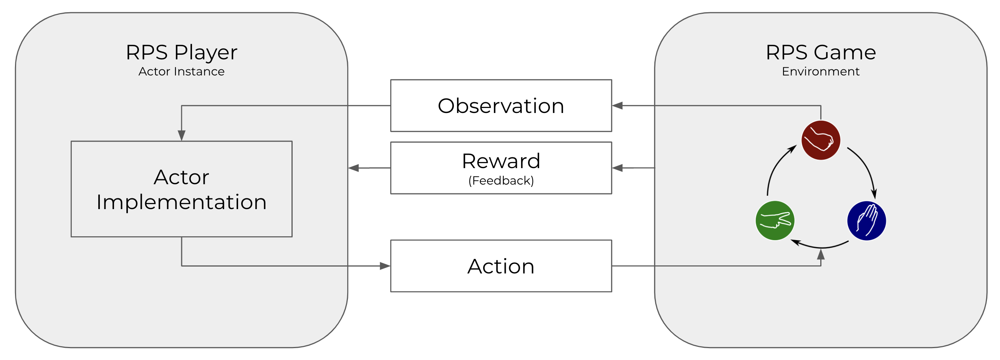
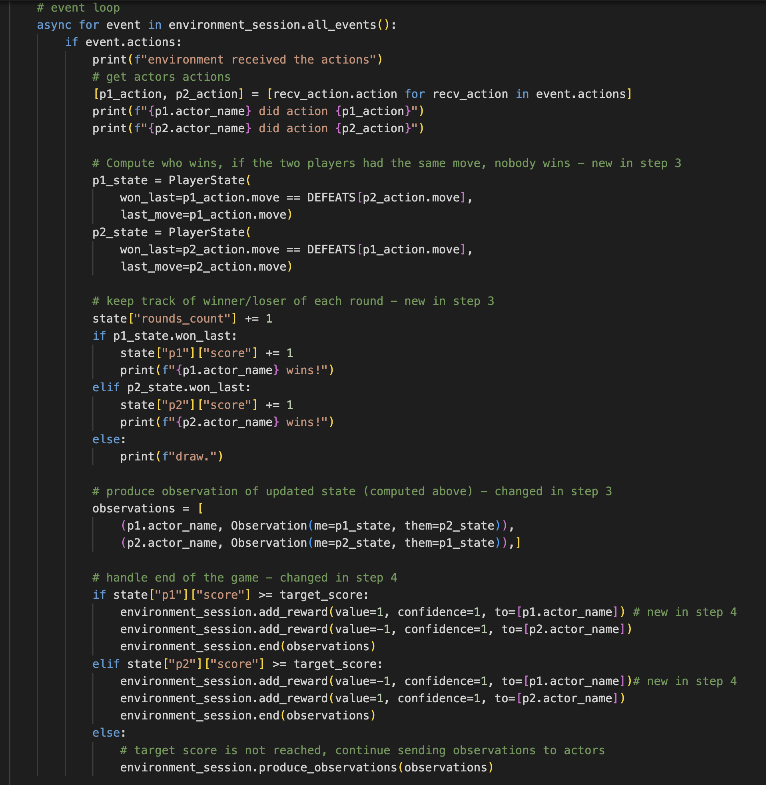

# Making Decisions with Feedback

In this step of the tutorial, we will start thinking about rewards. Rewards are a way to evaluate how an Actor performs at a task. They can be used to evaluate or compare different implementations of an Actor, or, especially in the context of Reinforcement Learning, train a model. In Cogment, both the environment and other actors can evaluate an actor. Here, we will focus on sending rewards from the environment.



Until now, the concept of game is only known to the Environment. It has no impact on the Observation and action spaces, and thus no impact on the Actor implementation. This means an actor wouldn't _know_ that the round it currently plays is the tie breaker in a game or its very first round. As a result the actor will play every round the same way.

In this step we will allow the Environment to send rewards to the actors, and modify `Bob`'s implementations to make use of this kind of information in gameplay and compare how it performs against `Alice`'s implementation.

## Sending Rewards to the Actors

Here, we will modify `environment/main.py` to include rewards when passing information to the Actors. Note that not all actions need to be rewarded. When a game is won, the Environment will add a **positive reward to the winner** (we chose a value of 1) and a **negative reward to the loser** (we chose a value of -1). Cogment also supports the notion of _confidence_, a weight between 0 and 1 that expresses the qualification of the reward sender in its appreciation. In this case we are applying objective rules, so we use a confidence of 1.

**In the event loop, when the first player wins a game we add the following:**

```python
environment_session.add_reward(value=1, confidence=1, to=[p1.actor_name])
environment_session.add_reward(value=-1, confidence=1, to=[p2.actor_name])
```

**When the second player wins a game we add the following:**

```python
environment_session.add_reward(value=-1, confidence=1, to=[p1.actor_name])
environment_session.add_reward(value=1, confidence=1, to=[p2.actor_name])
```

Modify the `environment/main.py` file to include the above additions.

Your Environment implementation event block should now look like this:



You can now [build and run](./1-setup.md#building-and-running-the-app) the application to check that it works as expected. In particular, you should see logs relative to the reception of rewards on the Actor side.

## Enabling Actors to Make Use of Information from the Environment

In this section, we will create a new Actor implementation in `actors/main.py` below our `random_agent` implementation. We'll call our new implementation `heuristic_agent` - it will just use a simple decision making logic for selecting an action based on the Observation it receives.

This Actor will also need to know what moves beat other moves. **In the "Settings" section, add the `DEFEATS` we specified in the Environment:**

```python
DEFEATS = {
  ROCK: PAPER,
  SCISSORS: ROCK,
  PAPER: SCISSORS
}
```

Now we can include a new Actor implementation that makes choices that utilize this knowledge. In `actors/main.py` add the following to the "Actor Implementation Functions" section:

```python
async def heuristic_agent(actor_session):
    # initialization
    actor_session.start()

    # event loop
    async for event in actor_session.all_events():
        if event.observation:
            observation = event.observation
            print(f"'{actor_session.name}' received an observation: '{observation}'")
            if event.type == cogment.EventType.ACTIVE:
                if observation.observation.me.won_last:
                    # I won the last round, let's play the same thing
                    actor_session.do_action(PlayerAction(move=observation.observation.me.last_move))
                elif observation.observation.them.won_last:
                    # I lost the last round, let's play what would have won
                    actor_session.do_action(PlayerAction(move=DEFEATS[observation.observation.them.last_move]))
                else:
                    # last round was a draw, let's play randomly
                    actor_session.do_action(PlayerAction(move=random.choice(MOVES)))
        for reward in event.rewards:
            print(f"'{actor_session.name}' received a reward for tick #{reward.tick_id}: {reward.value}")

    # termination
```

This heuristic player uses a simple strategy for winning: if my last move was successful, play it again, and if it wasn't, play what would have won the last round. If the last round ended in a draw, select an action at random.

## Registering a new Actor with Cogment

Before we can use this new actor, we will need to register it with Cogment.

**In the `main` function of `actors/main.py`, add the following:**

```python
context.register_actor(
    impl=heuristic_agent, # implementation defined above
    impl_name="heuristic_agent",
    actor_classes=["player",] # actor class defined in the cogment.yaml file
    )
```

This will make Cogment aware of an actor of the `player` class which uses the `heuristic_agent` implementation. Next, let's make `Bob` an Actor of this type.

# Modifying `Bob`

In `trial_runner/main.py`, we will need to change which type of registered Actor `Bob` is going to be in the game. Since we have registered this new Actor, all we need to do is change the `ActorParameters` for `Bob`. **In `trial_runner/main.py` set the `ActorParameters` for the Actor named `Bob` to be:**

```python
actor_1_params = cogment.ActorParameters(
    cog_settings,
    name="Bob",
    class_name="player",
    endpoint=ACTORS_ENDPOINT,
    implementation="heuristic_agent"
    )
```

You can now [install and run](./1-setup.md#building-the-application) the application to check that it works. Don't expect the heuristic player to beat the random player, the nature of the game actually rewards pure randomness in the playing. However, now you have all of the tools necessary implement various strategies and see how they fare against each other. This concludes the basic tutorial for Cogment in RPS. If you'd like to try some more advanced techniques, check out the [advanced tutorials](./advanced-tutorials/index.md).
