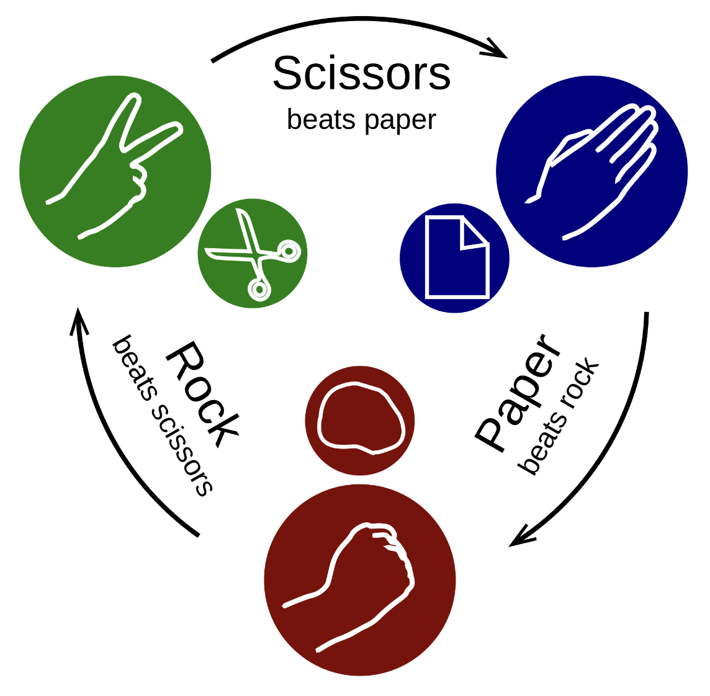
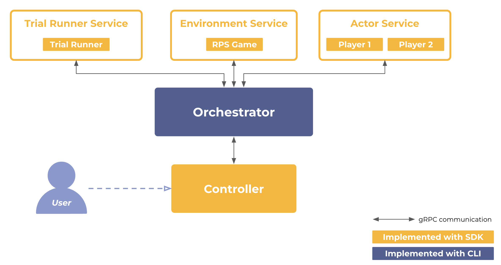
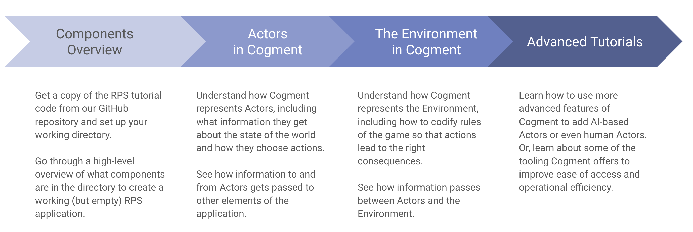

Here we will learn about the different elements of [Cogment](../../index.md) and how they fit together by creating a simulated game of [Rock-Paper-Scissors](https://en.wikipedia.org/wiki/Rock_paper_scissors). To run this tutorial locally, you will need to download or clone the source code from our [github repository](https://github.com/cogment/cogment-tutorial-rps).

### Prerequisites

This tutorial assumes a strong working knowledge of Python, as well as some basic familiarity with the following:

-   Reinforcement Learning (RL) - some fundamental ideas of RL are covered on the [Cogment Core Concepts](../core-concepts.md) page
-   [gRPC](https://grpc.io/) & [Protocol Buffers](https://protobuf.dev/)
-   Python's [asynchronous features](https://docs.python.org/3/library/asyncio-task.html), as the [Python SDK](../../reference/python.md) leverages this functionality

## Why Rock-Paper-Scissors (RPS)?

RPS is a hand game, usually played between two players, in which each player selects one of three possible hand-signs indicating rock, paper, or scissors.

RPS is a simultaneous, zero-sum game which has only two possible outcomes:

-   One player's action beats the other (i.e. they win and their opponent loses), or
-   Both players choose the same action and the game is a draw.

RPS is a very simple game with straightforward rules. As long as we forbid pure random moves, which are very difficult to beat, it is an interesting testbed to develop AIs that compete with Humans. Unlike "deep" games such as chess or go, the power is not really in the brute force exploration of possible outcomes, but rather in getting some level of understanding of how the opponent plays to be able to anticipate their moves. A good read on the subject of AI and RPS is this article by Benjamin Peterson: [Towards an AI for Rock, Paper, Scissors](https://towardsai.net/p/artificial-intelligence/towards-an-ai-for-rock-paper-scissors-3fb05780271f). This means as a tutorial to get acquainted with Cogment, RPS is simple enough to be easily implemented, and interesting enough to be a good example to showcase the different kinds of things Cogment is capable of doing.

## Formalizing RPS

Cogment is designed with the abstraction of reinforcement Learning in mind: tasks are broken down into sequential interactions between [Actor(s)](../core-concepts.md#actors) and the [Environment](../core-concepts.md#environment). The Actors are the players of RPS, and the Environment is the world the players operate in: which types of actions are allowed, the rules that specify the consequences of actions (eg. "scissors beats paper").

Actors usually need to know some information about the state of the world in order to make a choice about which action to select -- this kind of information is called an "[Observation](../core-concepts.md#state-and-observation-spaces)".

The Environment receives these actions and produces consequences -- updated Observations on the state of the world, and sometimes a reward signal, such as a win or loss. Reward signals are a useful way of quantifying goals, and are used in RL for training AI-based actors to improve their behaviour in pursuit of maximizing the rewards.

The repeated sequential interactions between players and the RPS game environment are handled by running [Trials](../core-concepts.md#trials) which coordinate the exchange of information between Actors and the Environment until a terminal condition is met.

### How does Cogment think of these pieces?

Cogment runs as a [distributed microservices architecture](https://www.atlassian.com/microservices/microservices-architecture/distributed-architecture#:~:text=A%20microservices%20architecture%20is%20one,users%2C%20products%2C%20etc.), meaning that the RPS Environment, each of the Actors, and the Cogment machinery that supports their interactions are all set up as separate services whose processes can be run on separate computation nodes. The operations carried out on each of these services are coordinated by the [Orchestrator](../../reference/cli/orchestrator.md), a key component of Cogment that ties all services together in order to execute the [Trials](../core-concepts.md#trials).

## Tutorial Roadmap

By the end of this basic tutorial you should understand the key elements of Cogment and how they work together. In particular, these steps cover how Cogment handles Actors and Environments and how the interactions between them are orchestrated to run trials. We start with a basic skeleton of each of these pieces, and add more detail as we go through the tutorial.

The [first step](./1-setup.md) of the tutorial is to get the code set up and make sure it functions properly. The basic code doesn't do anything interesting, but we will walk through what components are included so that it's clear how the different pieces fit together.

In [step 2](./2-actors-in-cogment.md), we will look at how Cogment represents Actors, what information they operate with, and how they communicate with the other components of the application

In [step 3](./3-environment-in-cogment.md), we will flesh out the details of the Environment. This involves specifying what types of actions are allowed in the game and the rules for what happens when actions are taken, as well as configuring the conditions for when a game has been won.

In [step 4](./4-decision-making.md), we will add feedback from the Environment and enable one of the Actors to reason about action selection given information in the Observation it receives. We'll look at how two Actors using different implementations perform in a game of RPS.

Once you understand the basic components of Cogment and how they work together, you may be interested in [more advanced tutorials](./advanced-tutorials/index.md) on how to implement more complex things with Cogment. We treat the more advanced tutorials as a "choose your own adventure" style of guide: [play with a human in the loop](./advanced-tutorials/6-human-player.md), [connect a web client for a better human user interface](./advanced-tutorials/7-web-client.md), or [improve operational efficiency by using some more advanced Cogment tooling](./advanced-tutorials/8-directory.md).
