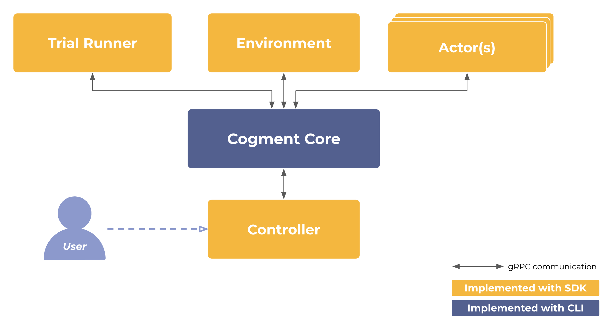

# What is Cogment?

[Cogment](https://cogment.ai) is the first open source platform designed to address the challenges of continuously training humans and AI together. Cogment is developed by [AI Redefined](https://ai-r.com) to enable AI practitioners to build, train and operate AI agents in simulated or real environments shared with humans. Fundamentally, Cogment is a set of tools designed to make it easier and more scalable to coordinate how Agents share information with each other and the Environment in which they operate.

Cogment is designed around the idea of sequential interactions between Actors and their Environment, as in [Reinforcement Learning (RL)](https://en.wikipedia.org/wiki/Reinforcement_learning). Cogment uses distributed micro-services to manage these interactions, so that different components can be run independently and asynchronously. This approach makes for more efficient and scalable solutions. It also means that Cogment can handle many actors in the same system, which makes it a great solution for implementing [Multi-Agent Systems (MAS)](https://en.wikipedia.org/wiki/Multi-agent_system) and Multi-Agent Reinforcement Learning (MARL).

Cogment treats human users and computer-based agents as the same from a high level point of view, rendering them interchangeable. This makes Cogment well-adapted to any kind of Human-In-the-Loop Learning (HILL) process, like Imitation Learning (IL) / Behavior Cloning (BC), RL from human feedback (RLHF) or even Active Learning. This allows computer-based agents to make use of human feedback and ultimately speed up the process of learning.

See our [white paper](https://arxiv.org/abs/2106.11345) for more details.

## How does Cogment work?

Cogment works by separating the different components of sequential decision-making tasks into different computational streams, and coordinating the results of these computations only when necessary. That is, different parts of the task are run as distributed microservices, and information is passed between services via gRPC protocol. This is made possible by a set of Cogment Core Components that can be used through a [Command Line Interface (CLI)](./reference/cli/index.md). These components are packaged in an easily distributable, cross-platform, standalone executable.

The full suite of Cogment tooling also includes software development kits (SDKs) for [Python](./reference/python.md) and [Javascript](./reference/javascript.md). These SDKs interface with the
Core Components in order to more easily work with Cogment to build out the specifics of your application, such as the simulated [Environment](./guide/core-concepts.md#environment) you want to work in, the [Actors](./guide/core-concepts.md#actors) involved, and the details of how you want them to interact in a [Trial](./guide/core-concepts.md#trials).



### What are the Core Components of Cogment?

The Core services, run through the Cogment CLI are:

-   The [**Orchestrator**](./reference/cli/orchestrator.md) is the **heart** of a Cogment app, which manages the operations and interactions of different components,
-   The [**Trial Datastore**](./reference/cli/trial-datastore/trial-datastore-server.md), which stores and makes available data generated while running Cogment,
-   The [**Model Registry**](./reference/cli/model-registry.md), which stores different versions of trained AI models to be used by Cogment agents.
-   The [**Directory**](./reference/cli/directory/directory-server.md), where Cogment services are registered and can be easily found by clients and other services.

The different Cogment components and how they interact can be summarized in the following diagram:


(The Directory is missing from this diagram, as it mainly works to facilitate the process of connecting all of the different services to each other.)

### What components are implemented with SDKs?

Software development kits (**SDKs**) are available in both [Python](./reference/python.md) and
[Javascript](./reference/javascript.md).

These can be used to build Cogment application services like Actors and simulated Environments, or client components such as an interface for a human user to interact with the application. Additionally, the SDKs are used to specify how Cogment trials (eg. interactions between Actors and their Environment) should be configured and run with the Trial Runner.

For more details, please see the dedicated reference page for the SDK in your preferred programming language. Stay tuned for development of new SDKs!

If you would like to get a more hands-on introduction to the details of how Cogment works, you can follow our [tutorial](./guide/tutorial/index.md).

## What is Cogment used for?

Cogment is especially well suited to address multi-agent contexts, regardless of their learning mechanisms (or, for that matter, whether they are of the learning kind or not).

Cogment may be a suitable approach if you want to:

-   Easily bootstrap a given system using human users, heuristic agents, or both, then transitioning seamlessly to an ML implementation
-   Utilize multiple ML approaches to contribute to a single role, which require balancing their contributions by some criteria (such as some rule set or performance metrics, for example)
-   Comparing different agent types/implementations without requiring any change in the implementation of the environment

## Getting Started with Cogment

Before diving right in, we recommend taking the time to read the [core concepts](guide/core-concepts.md) section which details the terminology we use for several critical concepts of Cogment. You can then proceed to read on how to [install](./reference/cli/index.md) the platform.

To get your hands dirty, proceed to the [tutorial](./guide/tutorial/index.md) for an introduction to all things Cogment. While Cogment can do many things, this tutorial aims to be a first introduction to the general principles of Cogment. The tutorial builds an application using the Python SDK to interface with Cogment. For more information about the range of features Cogment can offer, see the [Development Guide](./guide/development-guide.mdx) or [get connected with us](./community-channels.md).

## Citations

If you use **Cogment** in your research, please cite our [white paper](https://arxiv.org/abs/2106.11345) as follows:

```bibtex
@misc{air2021cogment,
    title={Cogment: Open Source Framework For Distributed Multi-actor Training, Deployment & Operations},
    author={AI Redefined and Sai Krishna Gottipati and Sagar Kurandwad and Clodéric Mars and Gregory Szriftgiser and
            François Chabot},
    year={2021},
    eprint={2106.11345},
    archivePrefix={arXiv},
    primaryClass={cs.AI}
}
```
