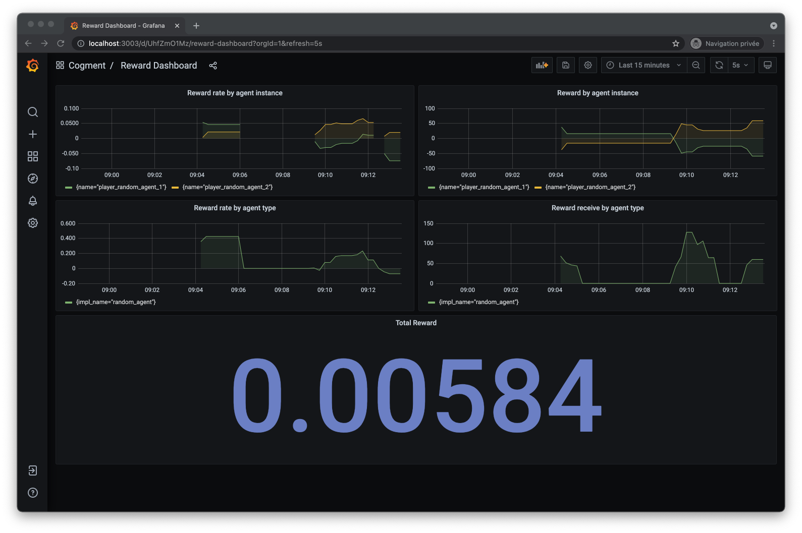

# Step 3 - Rewards

> This part of the tutorial follows [step 2](./2-random-player.md), make sure you've gone through it before starting this one. Alternatively the completed step 2 can be retrieved from the [tutorial's repository](https://github.com/cogment/cogment-tutorial-rps){target=\_blank}.

In this step of the tutorial, we will start thinking about rewards. Rewards are a way to evaluate how an actor performs at a task. They can be used to evaluate or compare different implementations of an actor, or, especially in the context or Reinforcement Learning, train an model. In Cogment, both the environment and other actors can evaluate an actor. Here, we will focus on sending rewards from the environment.

The first thing we'll do for this step is to add the concept of multi-round games to our RPS implementation. We'll learn to configure the environment along the way. Then, we will adapt the environment implementation to send a reward to the actor winning a game. Finally, we will retrieve rewards and other metrics from the running Cogment app.

## Adding the concept of a game

Up until now, our implementation of RPS focused on rounds. However, RPS is usually played in games won by the player reaching a target score, i.e. a number of won rounds.

Before sending rewards we need to adapt our implementation to support games. We will make the target score of each game configurable.

The generated data structure `EnvConfig`, referenced within `cogment.yaml` in `environment.config_type`, defines the configuration of the environment. Let's add a `target_game_score` numerical property to it.

```proto
message EnvConfig {
  int32 target_game_score = 1;
}
```

Modify the `data.proto` file with this update.

The environment implementation can now be updated to know about games.

During the **initialization** phase of the `environment` function, we can retrieve the value from the environment's configuration.

```python
target_game_score = environment_session.config.target_game_score
```

Instead of counting _rounds_ we update the `state` variable to count _games_ and the score of the ongoing game.

```python
state = {
    "games_count": 0,
    "p1": {
        "won_games_count": 0,
        "current_game_score": 0
    },
    "p2": {
        "won_games_count": 0,
        "current_game_score": 0
    },
}
```

In the **event loop** we need to make two changes.

First, Instead of counting the rounds, we will update each player `current_game_score`.

```python
if p1_state.won_last:
    state["p1"]["current_game_score"] += 1
elif p2_state.won_last:
    state["p2"]["current_game_score"] += 1
```

Second, once the observation is sent, we detect the end of each game and update the `state` accordingly.

```python
# Update the game scores
if state["p1"]["current_game_score"] >= target_game_score:
    state["games_count"] += 1
    state["p1"]["current_game_score"] = 0
    state["p2"]["current_game_score"] = 0
    state["p1"]["won_games_count"] += 1

    print(f"{p1.actor_name} won game #{state['games_count']}")
elif state["p2"]["current_game_score"] >= target_game_score:
    state["games_count"] += 1
    state["p1"]["current_game_score"] = 0
    state["p2"]["current_game_score"] = 0
    state["p2"]["won_games_count"] += 1

    print(f"{p2.actor_name} won game #{state['games_count']}")
```

Finally, during the **termination**, we display stats about the games.

```python
print(f"\t * {state['games_count']} games played")
print(f"\t * {p1.actor_name} won {state['p1']['won_games_count']} games")
print(f"\t * {p2.actor_name} won {state['p2']['won_games_count']} games")
```

Modify the `environment/main.py` file with these updates.

Now that the data structure is modified and the environment implementation uses it, we can define, for the default trial, a value for the `target_game_score` property. Let's start with games of 2 winning rounds.

```yaml
trial_params:
  environment:
    endpoint: grpc://environment:9000
    config:
      target_game_score: 2
```

Modify the `cogment.yaml` file with this update.

You can now [build and run](./1-bootstrap-and-data-structures.md#building-and-running-the-app) the application to check that it works as expected.

In this simple implementation, the concept of game is local to the environment. It has no impact on the observation and action spaces, and thus no impact on the actor implementation. This means an actor wouldn't _know_ that the round it currently plays is the tie breaker in a game or its very first round. As a result the actor will play every round the same way.

## Sending rewards to the actors

The environment is now able to:

- compute when an actor wins a game,
- communicate this information to it and to the other Cogment app services,
- send **rewards** when an actor reaches a measurable goal, in our case, when it wins a game.

Please note, that not all actions need to be rewarded.

When a game is won, the environment will add a **positive reward to the winner** (we chose a value of 1) and a **negative reward to the loser** (we chose a value of -1). Cogment also supports the notion of _confidence_, a weight between 0 and 1 that expresses the qualification of the reward sender in its appreciation. In this case we are applying objective rules, so we use a confidence of 1.

In the **event loop**, when the first player wins a game we add the following.

```python
environment_session.add_reward(value=1, confidence=1, to=[p1.actor_name])
environment_session.add_reward(value=-1, confidence=1, to=[p2.actor_name])
```

When the second player wins a game we add the following.

```python
environment_session.add_reward(value=-1, confidence=1, to=[p1.actor_name])
environment_session.add_reward(value=1, confidence=1, to=[p2.actor_name])
```

Modify the `environment/main.py` file to include the above additions.

You can now [build and run](./1-bootstrap-and-data-structures.md#building-and-running-the-app) the application to check that it works as expected. In particular you should see logs relative to the reception of rewards on the actor side.

## Using the **metrics** and **dashboard** services to retrieve & visualize the rewards over time

Now that we have introduced rewards, it's a good time to take a look at Cogment's dashboard, a web app centralizing metrics from the various Cogment components. To learn more about this, refer to the [dedicated page](../../dashboard/metrics-and-dashboard.md).

If it's not already running, start the Cogment app:

```console
$ cogment run start
```

In your browser of choice you can now open <http://localhost:3003> and explore. If you haven't yet launched any trials, it should be mostly empty. To launch a trial, proceed as usual: in another terminal run,

```console
$ cogment run client
```

You can now check the **reward dashboard** to see which of the players performs better. Keep in mind that both players play randomly so don't expect to observe any interesting trends yet. You can launch several trials to get more data.



The screenshot above shows the default reward dashboard. On the top row, it shows the reward received per individual actor, on the left is the rate averaged over the last 2 minutes, on the right is the total per trial. On the middle row, you'll find the same metrics but aggregated per actor implementation, one in our case. On the bottom row is the averaged reward over the last 5 minutes for all the actors.

In [tutorial 7](./7-dqn-player.md), we will use this dashboard to monitor the training of an agent implementation.

This concludes the step 3 of the tutorial: you've learned about environment configuration, implemented your reward sending and used the **metrics** and **dashboard** services.

Let’s move on to implementing an RPS player that actually considers what was played before deciding on its next move in [step 4](./4-heuristic-player.md).
