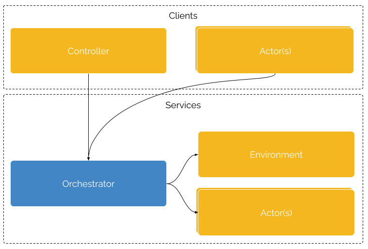

# Cogment Core Concepts Guide

Welcome to the Cogment core concepts guide. It contains information that is pertinent to both the [high-level SDK](../cogment/cogment-api-guide.md) and the [low-level API](../cogment/cogment-low-level-api-guide/overview.md).

## Core Concepts

Cogment is built around concepts adapted from multi-agent systems (agents, environment), Markov decision processes (action and observation space) and reinforcement learning (trials, rewards).

### Trials

[Trials](./glossary.md#trial) are what a Cogment deployment runs. They enable [Actors](./glossary.md#actors) to interact with their [Environment](./glossary.md#environment). Trials are started by clients connecting to Cogment. A trial can end either by being terminated from a client or end by itself, for example once a specific state of the Environment is reached.

During the trial:

- The [Environment](./glossary.md#environment) generates [**observations**](./glossary.md#observation) of its internal state and sends them to the [actors](./glossary.md#actor).
- Given these [observations](./glossary.md#observation), each [actor](./glossary.md#actor) might choose and take an [**action**](./glossary.md#action).
- The [Environment](./glossary.md#environment) receives the [actions](./glossary.md#action) and updates its state.
- [**Rewards**](./glossary.md#reward) can be sent to the [actors](./glossary.md#actor) from either the environment or other actors.
- [Actors](./glossary.md#actor) receive [**rewards**](./glossary.md#reward).
- The [actors](./glossary.md#actor) or the [environment](./glossary.md#environment) can send [**messages**](./glossary.md#message) to actors or the environment.
- A log of the activity during the trial (observations, actions, rewards & messages) is produced and can be stored.

A trial is defined by the participating [Actors](./glossary.md#actor) and the host [Environment](./glossary.md#environment). As a concept, Trials are quite close to Reinforcement Learning (RL)'s **Episodes**, i.e. all the states that come between an initial state and a terminal state. However, because Cogment can be used outside of an RL context, we prefer using the more generic term of Trial.

### Actors

[Actors](./glossary.md#actor) within a trial instantiate [actor classes](./glossary.md#actor-class) defined by the nature of the information they receive from the [environment](./glossary.md#environment), their [observation space](./glossary.md#observation-space), and what actions they can perform, their [action space](./glossary.md#action-space).

In Cogment, the observation and action space are defined as typed data structures. In particular, Cogment uses [protobuf](./glossary.md#protocol-buffer) as a format to specify these data structures. This typing defines both an interface contract between the [Actors](./glossary.md#actor) and the [Environment](./glossary.md#environment) and helps convey semantic information, thus facilitating the independent design and development of both.

An [Actor](./glossary.md#actor) might be controlled either by a software [Agent](./glossary.md#agent), or by a Human. Whichever the case, the process of generating [actions](./glossary.md#action) based on [observations](./glossary.md#observation) remains the same, and the [Environment](./glossary.md#environment) treats them the same.

### Environment

The [Environment](./glossary.md#environment) is the context within which the [Trial](./glossary.md#trial) takes place. The Environment receives the [actions](./glossary.md#actions) done by the actors, usually updates an internal state, and generates an [observation](./glossary.md#observation) for each [Actor](./glossary.md#actor).

The Environment is the main integration point between Cogment and an external system, either a **simulation** or a **real world system**.

## The cogment.yaml

At the heart of every Cogment project is a [YAML](https://yaml.org) file typically called `cogment.yaml`. Its primary role is to define the [actor classes](./glossary.md#actor-class) present within the project, including their [action](./glossary.md#action-space) & [observation spaces](./glossary.md#observation-space), as well as a default configuration for trials, including the number of actor participating in each [trial](./glossary.md#trial) and their class and implementation.

## Architecture

Running trials with Cogment usually involves the deployment of a cluster of services and its clients. These components are either provided by the Cogment framework, depicted below in blue, or implemented for a particular project, depicted below in orange.

User implemented components use one of the [Cogment SDKs](../cogment/cogment-api-guide.md) or directly implement the [underlying protocol](../cogment/cogment-low-level-api-guide/overview.md). Components communicate using [gRPC](https://grpc.io), clients can also communicate in a web-friendly way using [gRPC-Web](https://grpc.io/docs/platforms/web/) and [grpcwebproxy](https://github.com/improbable-eng/grpc-web/tree/master/go/grpcwebproxy).

### Orchestrator

The Orchestrator is the glue that binds everything together. It is responsible for running the [trials](./glossary.md#trial) and contacting other services as needed to ensure their execution.

The key aspect of Cogment's orchestrator is its capacity to handle a number of network connections in parallel while keeping its responsiveness.

### Controller

The Controller is a key part of using Cogment, it initiates communication with the Orchestrator to control the execution of [trials](./glossary.md#trial). It is responsible for starting [Trials](./glossary.md#trial), retrieving and watching their state (including the end of the trial), or requesting trial termination.

### Environment

The Environment implementation is accessed by the [Orchestrator](./glossary.md#orchestrator) to run the [Environment](./glossary.md#environment) during [Trials](./glossary.md#trial).

Using one of [Cogment's SDKs](../cogment/cogment-api-guide.md), the Environment can be implemented as a function integrating a _"state of the world"_ with the [Trial](./glossary.md#trial). This function performs the following tasks during the Trial:

- Generate [Observations](./glossary.md#observation) from the current _state of the world_, for example retrieving the visible objects from a 3D simulation.
- Apply the [Actions](./glossary.md#action), thus updating the _state of the world_, for example changing the velocity of a moving vehicle in a race simulation.
- Evaluate the performance of [Actors](./glossary.md#actor) and send them [Rewards](./glossary.md#reward), for example by checking if a vehicle crossed the finish line in a race simulation.
- Send and receive direct messages.

### Actors

Actors can be implemented in two different ways, either as a service or as a client. **Service Actor** implementations are accessed by the [Orchestrator](./glossary.md#orchestrator) during [Trials](./glossary.md#trial), while **Client Actor** implementations join a Trial by initiating the communication with the Orchestrator. Client Actors implementations can _reach_ a Cogment deployment through [NAT traversal](https://en.wikipedia.org/wiki/NAT_traversal). This makes them particularly well-suited to implement human-driven Actors, in web-browsers for example.

Using one of [Cogment's SDKs](../cogment/cogment-api-guide.md) Actors can be implemented as functions handling the integration between a decision-making Actor ([software agent](./glossary.md#agent) or Human) and the [Trial](./glossary.md#trial). This function performs the following tasks during the Trial:

- Receive [Observations](./glossary.md#observation) and do [Actions](./glossary.md#action) in response, for example vectorizing the retrieved observation, feeding it to a neural network and converting its output to an Action.
- Receive [Rewards](./glossary.md#reward), for example using them to update a neural network.
- Send and receive direct messages.

Please note that rewards can also be retrieved after the fact using an [activity logger](#additional-optional-services).

#### Additional optional services

Beyond the core services described above, a Cogment deployment can include these additional ones:

- **Pre trial hooks** can be used to dynamically setup Trials from a given configuration, for example changing the number of Actors or pointing to other Environment or Actor implementations.
- **Activity Logger** can be used to listen to the activity during a trial (actions, observations, rewards, messages), for example, to do store these data in order to do offline training of AI agents.
