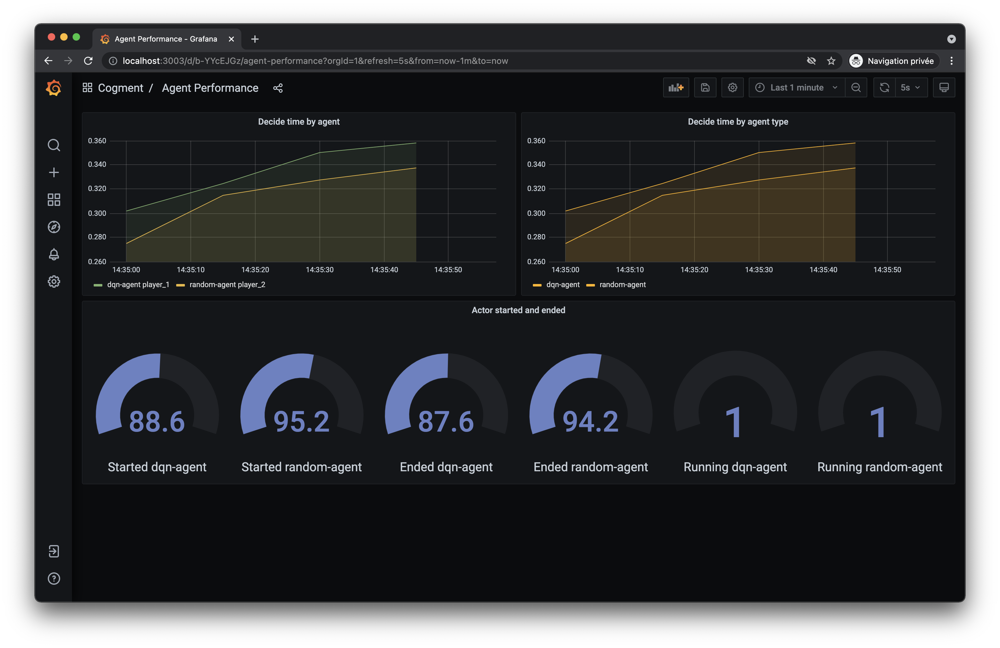
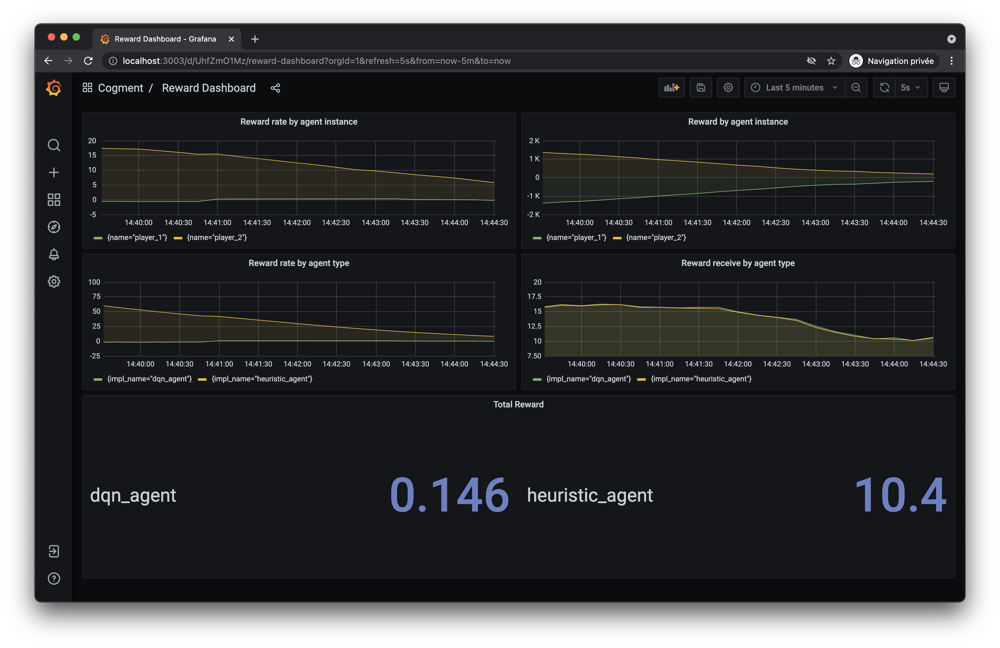

# Metrics and Dashboard

Cogment provides two services out of the box dedicated to the monitoring of a Cogment deployment: `cogment-metrics` and `cogment-dashboard`.

`cogment-metrics` is gathering data coming from all the Cogment services: orchestrator, actors, environment, .... These _metrics_ can be used to gather insights regarding the performances of actor or environment implementations. They can also be used to follow the attribution of rewards, giving insight into how, or even if agents are learning.

`cogment-metrics` is a [Prometheus](https://prometheus.io/) instance, so it can be easily augmented to visualize your own data.

`cogment-dashboard` is used to explore the metrics data in a human-friendly way, using graphs. Some default dashboards are available, but users can create their own dashboards, as well as use their own [Prometheus](https://prometheus.io/) requests to create their own graphs. `cogment-dashboard` is based on [Grafana](https://grafana.com/).

## Usage

By initializing your project using [`cogment init`](../cogment/tutorial/1-bootstrap-and-data-structures.md), you should already have everything setup for you. Otherwise, please refer to the complete [setup](#initial-setup).

In an up-and-running Cogment deployment running on your local machine, the dashboard is accessible at <http://localhost:3003/>

The dashboard welcomes you with a screen giving you direct access to the default sub-dashboards.


For example, the agent performances sub-dashboard gives you an idea of how long it takes for actors to handle a new set of observations as well as the number of created instances for each actor implementation. Here's an example taken after a few minutes running [tutorial #7](../cogment/tutorial/7-dqn-player.md).



A similar sub-dashboard is available for environment performances.


Another useful sub-dashboard pertains to the rewards. This enables you to follow the progress of the different actor implementations during training. Here's another example taken after a few minutes running [tutorial #7](../cogment/tutorial/7-dqn-player.md), the DQN agent is about to surpass the heuristic baseline.



## Initial setup

To setup dashboard and metrics on a docker-based Cogment deployment only two files need to be modified and a third file needs to be created:

-   `docker-compose.yaml`
-   `cogment.yaml`
-   Add a `metrics/prometheus.yml`

### Setup services in `docker-compose.yaml`

#### Metrics

Create a service named `metrics` using the `cogment/metrics` docker image. Log level is decreased to avoid too much verbosity, the yml file is provided in a mounted volume and another one is provided for Prometheus to store its data.

```yaml
metrics:
    user: 0:0
    image: cogment/metrics:latest
    command: --config.file=/etc/prometheus/prometheus.yml --log.level=error
    volumes:
        - ./metrics/prometheus.yml:/etc/prometheus/prometheus.yml:ro
        - ./metrics/data:/prometheus
```

<!-- prettier-ignore -->
!!! warning
    It is recommended to use a fixed version of `cogment/metrics`, refer to <https://github.com/cogment/cogment-dashboard> to get its version number.

#### Dashboard

Create a service named `dashboard` and pick an exposed port to consult.

```yaml
dashboard:
    image: cogment/dashboard:latest
    ports:
        - 3003:3000/tcp
    depends_on:
        - metrics
```

<!-- prettier-ignore -->
!!! warning
    It is recommended to use a fixed version of `cogment/dashboard`, refer to <https://github.com/cogment/cogment-dashboard> to get its version number.

### Launch containers in `cogment.yaml`

It is recommended to start and stop `dashboard` and `metrics` alongside the other services of the Cogment deployment. The easiest way to do that is to add `dashboard metrics` to the start and stop commands in your `cogment.yaml` file.

```yaml
start: docker-compose up dashboard metrics orchestrator environment [...]
stop: docker-compose stop dashboard metrics orchestrator environment [...]
```

### Configure Prometheus in `metrics/prometheus.yml`

Prometheus will collect data from various services, from the environment and the actors. All those data will be stored in `./metrics/data`. More information about how Prometheus can store data is available [here](https://prometheus.io/docs/prometheus/latest/storage/).

Inside `metrics/prometheus.yml`, each service that will be monitored should be added like below. In the following example the environment service is the only one that will be collecting data.

```yaml
global:
    scrape_interval: 5s # Set the scrape interval to every 5 seconds. Default is every 1 minute.
    evaluation_interval: 5s # Evaluate rules every 5 seconds. The default is every 1 minute.

# A scrape configuration containing exactly one endpoint to scrape:
scrape_configs:
    # The job name is added as a label `job=<job_name>` to any timeseries scraped from this config.
    - job_name: "environment"
      dns_sd_configs:
          - names:
                - "environment" # Hostname of the environment service (from ./docker-compose.yaml)
            type: "A"
            port: 8000
            refresh_interval: 5s
```

## Recipes

### Retrieving services from a new service

To add other services from which to collect data, simply add other `scrape_configs`.

```yaml
scrape_configs:
    # Here you should have existing configuration for other services.
    # Here add a new service that will be monitored
    - job_name: "new_service"
      dns_sd_configs:
          - names:
                - "new_service" # Hostname of the service as defined in ./docker-compose.yaml
            type: "A"
            port: 8000 # Port on which the prometheus agent is running, Cogment SDKs uses 8000 by default
            refresh_interval: 5s
```

More information can be found in the [Prometheus documentation](https://prometheus.io/docs/prometheus/latest/getting_started/)

### Monitoring personalized metrics

You can add your own metrics in your code by using the Prometheus API. Added metrics will be _automagically_ discovered by the Prometheus agent that is started by the Cogment SDKs.

Here's how it looks in python.

```python
from prometheus_client import Summary, Counter

MY_SUMMARY = Summary('my_func', 'Time spent')
MY_COUNTER = Counter('metrics_to_count', 'The stuff I want to count')

#[...]

@MY_SUMMARY.time() # Will automatically measure the time spent
def my_func()
    MY_COUNTER.inc()
```

Several types of metrics are availalbe in Prometheus. Connsult the prometheus [documentation](https://prometheus.io/docs/concepts/metric_types/) for futher references.

## Using a custom registry

By default, Cogment SDKs rely on the default Prometheus global registry. To change the used regitry, it needs to be given to the context when built.

Here's how it looks in python.

```python
import cog_settings

import cogment
import prometheus_client

# [...]

registry = prometheus_client.CollectorRegistry()
context = cogment.Context(cog_settings=cog_settings, user_id="my_user_id", prometheus_registry=registry)
```

It is also possible to completely deactivate the gathering of the Prometheus metrics by setting `prometheus_registry` to `None`.

```python
context = cogment.Context(cog_settings=cog_settings, user_id="my_user_id", prometheus_registry=None)
```
